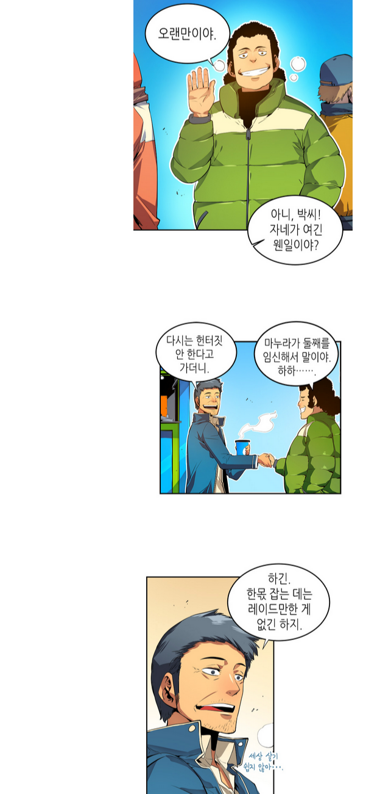
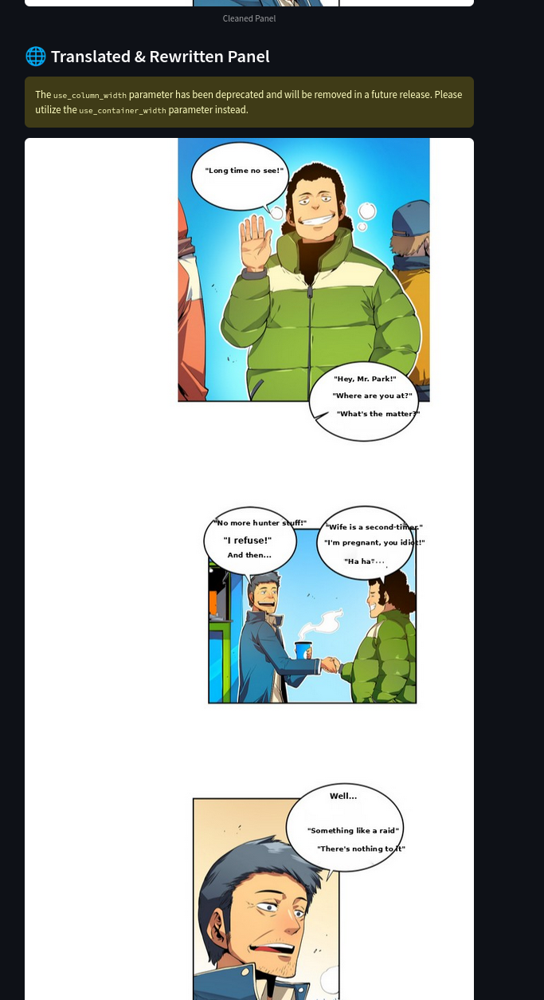
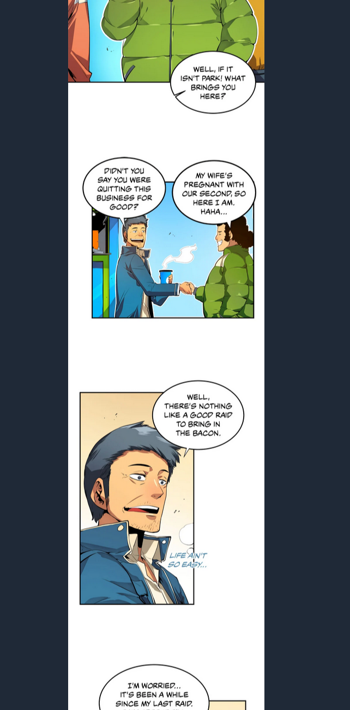

# 🌐 Manga Translator: Korean to English Webtoon Panel Translator

This project demonstrates an end-to-end pipeline for automatically translating Korean webtoon panels into English using OCR and large language models. It combines visual text extraction, contextual translation, and image manipulation to maintain the visual aesthetics of the comic panel while replacing the original text with its English equivalent.

---

## 📷 Before vs After Screenshots

| Original Panel (Raw Image) | Machine-Translated Panel | Human-Translated Panel |
|---------------------------|---------------------------|------------------------|
|  |  |  |

---

## ✨ Key Features

- **OCR with EasyOCR**: Extracts Korean text and bounding boxes from webtoon panels.
- **Contextual Translation with Mistral 7B**: Uses a locally hosted `Nous-Hermes-2-Mistral-7B-DPO` model in `.gguf` format via `llama-cpp-python` to perform accurate and natural English translations.
- **Auto Font Resizing & Placement**: Fits translated text inside the original speech bubble's bounding box, preserving visual layout.
- **Streamlit App Interface**: Upload a raw panel and receive the cleaned and translated panel with one click.

---

## 🚀 How It Works

1. **Upload Image**: User uploads a panel through the Streamlit web interface.
2. **OCR Phase**: EasyOCR reads Korean text and detects bounding boxes.
3. **Translation Phase**: Each extracted text is sent to the Mistral 7B model with a prompt:
    ```
    Translate the following Korean dialogue to natural conversational English for a comic panel:
    "<Korean Text>"
    English:
    ```
4. **Text Placement**: Translated text is resized to fit inside the detected bubble and rendered on the cleaned panel using Pillow.
5. **Downloadable Output**: The final panel is displayed and offered for download.

---

## 🔧 Setup & Installation

### 1. Clone the Repository
```bash
git clone https://github.com/aneesnashath/Manga-Translator.git
cd Manga-Translator
```

### 2. Install Dependencies
```bash
pip install -r requirements.txt
```

### 3. Download & Place Model
Place your `Nous-Hermes-2-Mistral-7B-DPO.Q4_K_M.gguf` model in a known location and set its path in the `insert_text.py` file.

### 4. Run the Streamlit App
```bash
streamlit run app.py
```

---

## 🌐 Technologies Used

- Python 3.12
- [EasyOCR](https://github.com/JaidedAI/EasyOCR)
- [llama-cpp-python](https://github.com/abetlen/llama-cpp-python)
- [Streamlit](https://streamlit.io/)
- OpenCV, Pillow
- Mistral 7B LLM (`gguf` format)

---

## 📈 Results & Observations

- **Accuracy**: The model performs impressively on casual/conversational text.
- **Speed**: Local inference is fast enough for panel-wise translation.
- **Limitations**:
  - Some characters might render awkwardly if the bounding box is too small.
  - Deep cultural nuance still needs careful handling, which may benefit from further LLM fine-tuning.

---

## 🌐 Future Work

- Support additional languages (Japanese, Chinese, Arabic, etc.)
- Add style-consistent font selection
- Integrate a panel cleaning model to automate removing the Korean text
- Deploy GPU-backed API for faster real-time processing

---

## 🙌 Acknowledgements

- HuggingFace / Nous-Hermes-2 model
- JaidedAI for EasyOCR
- Mistral & llama.cpp team for blazing fast local inference

---

## 📖 License

This project is released under the MIT License.

---

## 📢 Feedback

Have an idea or want to contribute? Open an issue or pull request on [GitHub](https://github.com/aneesnashath/Manga-Translator)!

